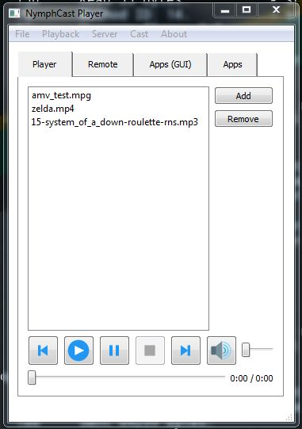
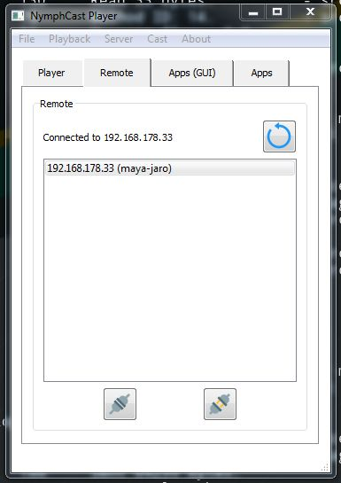
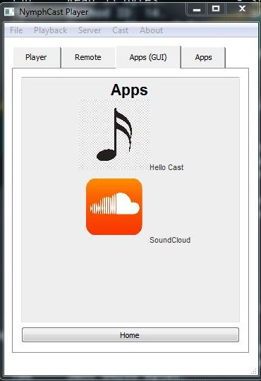

[Repository Structure](#id-rs) &middot; [Getting Started](#id-gs) &middot; [Building From Source](#id-bfs) &middot; [Developer's Guide](#id-dg) &middot; [SDK](#id-sdk) &middot; [License](#id-lic)

# What is NymphCast? #

NymphCast is a software solution which turns your choice of Linux-capable hardware into an audio and video source for a television or powered speakers. It enables the streaming of audio and video over the network from a wide range of client devices, as well as the streaming of internet media to a NymphCast server, controlled by a client device.

In addition, the server supports powerful NymphCast apps written in AngelScript to extend the overall NymphCast functionality with e.g. 3rd party audio / video streaming protocol support on the server side, and cross-platform control panels served to the client application that integrate with the overall client experience.  

NymphCast requires at least the server application to run on a target device, while the full functionality is provided in conjunction with a  remote control device: 

Client-side core functionality is provided through the NymphCast library.

### **NymphCast Player Client** ###

The NymphCast Player is provided as a demonstration of the NymphCast SDK (see details on the SDK later in the document), implementing basic NymphCast functionality. It is designed to run on any mainstream desktop OS, as well as Android-based smartphones and tablets.

 

### **Server Platforms** ###

The server targets SBCs, but like the client (and SDK) should work on any platform that supports a C++17 toolchain and is supported by the LibPoco dependency:

* **Desktop/Server:** Windows, Linux, macOS, Solaris, HP-UX, AIX
* **Embedded/Mobile:** Windows Embedded CE, Embedded Linux (uClibc or glibc), iOS, Android, QNX, VxWorks

The server relies on the FFmpeg and SDL2 libraries, which are supported on a wide variety of platforms, with Linux, MacOS and Windows being the primary platforms.

### **Limitations** ###

The server is assumed to have 100 MB heap space free for caching.

## Repository Structure ##

The repository currently contains the NymphCast server, NymphCast Player client sources. Some developer tools are also provided but are of no concern for the first-time user.

	/
	|- player 	(the NymphCast demonstration client)
	|- src/
	|	|- client 		(basic NymphCast client, for testing)
	|	|- client_lib 	(NymphCast SDK files)
	|	|- server		(the NymphCast server and NymphCast app files)
	|- tools	(shell scripts for creating releases, in progress)

## Getting Started ##

To start using NymphCast, you need a device on which the server will be running (most likely a SBC or other Linux system). NymphCast is offered as binaries for selected distros, and as source code for use and development on a variety of platforms.

### **Releases** ###

NymphCast is currently in Alpha stage. Experimental releases are available on Github (see the ['Releases'](https://github.com/MayaPosch/NymphCast/releases) folder).

Some packages also exist for selected distros.

For **pacman**-based distros (ArchLinux, Manjaro):

* the server: [nymphcast-server-git](https://aur.archlinux.org/packages/nymphcast-server-git/)
* the sdk: [nymphcast-sdk-git](https://aur.archlinux.org/packages/nymphcast-sdk-git/)
* the player client: [nymphcast-player-git](https://aur.archlinux.org/packages/nymphcast-player-git/)

For **Alpine Linux** and postmarketOS:

* the server: [nymphcast-server](https://pkgs.alpinelinux.org/package/edge/testing/x86_64/nymphcast-server)
* the sdk: [nymphcast-dev](https://pkgs.alpinelinux.org/package/edge/testing/x86_64/nymphcast-dev)
* the player client: [nymphcast-client](https://pkgs.alpinelinux.org/package/edge/testing/x86_64/nymphcast-client)

Player client releases for **Android** and **Windows**:

* APK for installation on Android, see ['Releases'](https://github.com/MayaPosch/NymphCast/releases) 
* desktop client for Windows(x64), see ['Releases'](https://github.com/MayaPosch/NymphCast/releases)   

If pre-compiled releases for your target device or operating system are currently not listed above, you may need to build the server and client applications from source.

  
### **Running NymphCast** ###

The **server binary** can be started with just a configuration file.
To start the server, execute the binary (from the `bin/` folder) to have it start listening on port 4004: 

`./nymphcast_server -c nymphcast_config.ini`.
 
The server will listen on all network interfaces for incoming connections. It supports the following options:
<pre>
-h	--help				Get this help message.
-c	--configuration		Path to the configuration file.
-a	--apps				Path to the NymphCast apps folder.
-w	--wallpaper			Path to the wallpapers folder.
-v	--version			Output NymphCast server version and exit.
</pre>

The **client binary** has to be provided with the filename of a media file that should be sent to the remote server, with an optional IP address of the remote server:

	$ nymphcast_client <filename>
	$ nymphcast_client <IP> <filename>

The **NymphCast Player** is a GUI-based application and accepts no command line options.

## Building From Source ##

**Note:** This section is for building the project from source. Pre-built binaries are provided in the ['Releases'](https://github.com/MayaPosch/NymphCast/releases) folder.

The steps below assume building the server part on a system like a Raspberry Pi, and running a current version of Debian (Buster) or equivalent. The player client demo application can be built on Linux/BSD/MacOS with a current GCC toolchain, or MSYS2 on Windows with MinGW toolchain. 

Once the project files are downloaded and the dependencies are satisfied, run the Makefile in the `client` and `server` folders, which should output a binary into the newly created `bin/` folder.
To build the corresponding parts of NymphCast, in addition to a C++ toolchain with C++17 support, one needs the dependencies as listed below.

### **Server Dependencies** ###

* [NymphRPC](https://github.com/MayaPosch/NymphRPC)
* [LibAV](https://trac.ffmpeg.org/wiki/Using%20libav*) (v4+) 
* LibSDL2
* LibSDL2_Image
* LibPOCO (1.5+)

On **Debian** & derivatives:

Install the needed dependencies: `sudo apt -y install libsdl2-image-dev libsdl2-dev libpoco-dev` and `sudo apt -y install libswscale-dev libavcodec-dev libavdevice-dev libavformat-dev libavutil-dev libpostproc-dev libswresample-dev`

### **Client Library Dependencie**s ###

* [NymphRPC](https://github.com/MayaPosch/NymphRPC)
* LibPOCO (1.5+)

### **Building The Server** ###

If using a compatible OS (e.g. **Debian** Buster, Alpine Linux or Arch Linux), one can use the setup script: 

1. Run the `setup.sh` script in the project root to perform the below tasks automatically.
2. Run the `install_linux.sh` script in the project root to install Avahi & Systemd services on Linux systems which support both.

Else, use the manual procedure:

1. Check-out [NymphRPC](https://github.com/MayaPosch/NymphRPC) elsewhere and build the library with `make lib`.
2. Copy the NymphRPC library from `NymphRPC/lib/` to `/usr/local/lib` (or on Linux: shared library to `usr/lib`).
3. Create `/usr/local/include/nymph` folder. Perform `sudo cp src/*.h /usr/local/include/nymph`.
4. Change to `NymphCast/src/server` and execute `make` command.
5. The server binary is found under `bin/`. Copy the *.jpg images into a `bin/wallpapers/` folder for the screensaver feature.
6. Copy the `nymphcast_config.ini` file into `bin/` as well.
7. Copy the `apps/` folder into the `bin/`' folder.

### **Building The NymphCast Player Client** ###

This demonstration client uses Qt5 to provide user interface functionality. The binary release comes with the necessary dependencies, but when building it from source, make sure Qt5.x is installed or get it from [www.qt.io](https://www.qt.io/download).

For Windows (x64):

1. Download and extract the binary release.

Or (building and running on Windows & other platforms):

1. Download or clone the project repository 
2. Build the libnymphcast library in the `src/client_lib` folder using the Makefile in that folder: `make lib`.
3. Install the newly created library under `lib/` into `/usr/local/lib` or equivalent.
4. Copy the `nymphcast_client.h` header to `/usr/local/include` or equivalent.
5. Ensure the Qt5 SDK is installed.
6. Create `player/NymphCastPlayer/build` folder and change into it.
7. Execute `qmake ..` followed by `make`.
8. The player binary is created either in the same build folder or in a `debug/` sub-folder.

Now you should be able to execute the player binary, connect to the server instance using its IP address and start casting media from a file or URL.

## Developer's Guide ##

The focus of the project is currently on the development of the NymphCast server and the protocol parts. We're encouraging third parties to contribute server-side app support of their services and developers in general to contribute to server- and client-side development.

The current server and client documentation is hosted at the [Nyanko website](http://nyanko.ws/nymphcast.php).

## SDK ##

An SDK has been made available in the `src/client_lib/` folder. The player project under `player/` uses the SDK as part of a Qt5 project to implement a NymphCast client which exposes all of the NymphCast features to the user.

To use the SDK, the Makefile in the SDK folder can be executed with a simple `make` command, after which a library file can be found in the `src/client_lib/lib` folder. 

**Note:** to compile the SDK, both [NymphRPC](https://github.com/MayaPosch/NymphRPC) and LibPOCO (1.5+) must be installed.

After this the only files needed by a client project are this library file and the `nymphcast_client.h` header file. 

## License ##

NymphCast is a fully open source project. The full, BSD-licensed source code can be found at its project page on Github, along with binary releases.

This also means that NymphCast is fully free. Its development therefore relies on your support. If you appreciate the project, your contribution or [donation](http://nyanko.ws/nymphcast.php) can support the continued development.

