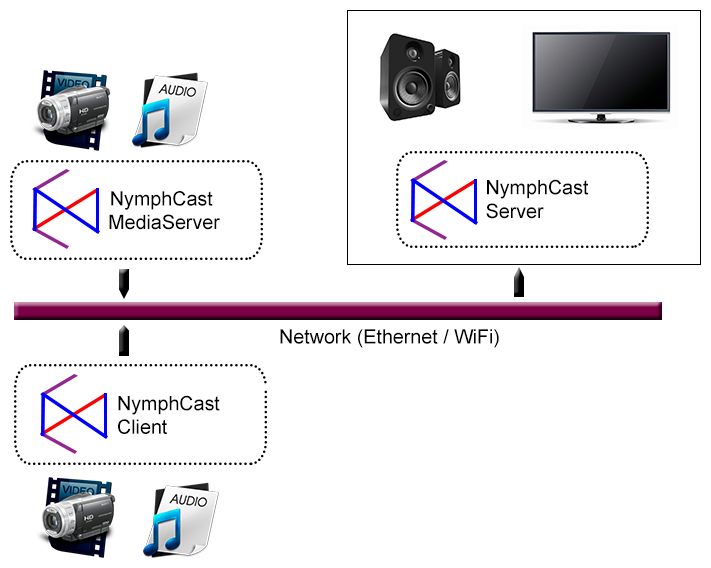

[Repository Structure](#id-rs) &middot; [Getting Started](#id-gs) &middot; [Multi-Room Playback](#id-mrp) &middot; [Building From Source](#id-bfs) &middot; [Developer's Guide](#id-dg) &middot; [SDK](#id-sdk) &middot; [License](#id-lic) &middot; [Donate](#id-donate)

# What is NymphCast? #

NymphCast is a software solution which turns your choice of hardware into an audio and video source for a television or (powered) speakers. It enables the streaming of audio and video over the network from a client device or media server, as well as the streaming of internet media to a NymphCast server, controlled by a client device, or directly on the receiver.

In addition, the server supports NymphCast apps (currently in preview status) written in AngelScript to extend the overall NymphCast functionality with e.g. 3rd party audio / video streaming protocol support on the server side, and customisable UIs in the client application.

NymphCast requires the use of a client device in all but the GUI ('Smart TV') mode. The server application (receiver) runs on a target device, while the client device functions as a remote control device:



Client-side core functionality is provided through the NymphCast library.

## NymphCast Audio demo ##

The [following video](https://youtu.be/bc4qn4thHrc) demonstrates NymphCast (v0.1-RC1) in an audio setup with a Raspberry Pi 2B, USB WiFi dongle, Generic 2.1 speaker set and an Android phone.

[.png)](https://youtu.be/bc4qn4thHrc)

## Usage Scenarios ##

NymphCast can be used in a number of scenarios:

- **NymphCast Audio** :arrow_right: Audio-only receiver mode.
	+ Profile: `nymphcast_audio_config.ini`
	+ [Setup guide](doc/nymphcast_audio_setup_guide.md)
- **NymphCast Video** :arrow_right: Audio & Video receiver mode.
	+ Profile: `nymphcast_video_config.ini`
	+ [Setup guide](doc/nymphcast_video_setup_guide.md)
- **NymphCast ScreenSaver** :arrow_right: Like NymphCast Video, but with image-based ScreenSaver when not playing content.
	+ Profile: `nymphcast_screensaver_config.ini`
	+ [Setup guide](doc/nymphcast_screensaver_setup_guide.md)
- **NymphCast GUI** :arrow_right: Like NymphCast Video, but with stand-alone GUI mode (smart TV) enabled. (experimental feature)
	+ Profile: `nymphcast_gui_config.ini`
	+ [Setup guide](doc/nymphcast_gui_setup_guide.md)
	


## Network ports ##

**Note:** NymphCast Server uses UDP port 4004 for discovery, and TCP port 4004 for playback.

All of these ports have to be reachable on a system running NymphCast Server.

Systems running the [NymphCast MediaServer](https://github.com/MayaPosch/NymphCast-MediaServer) also need to have UDP & TCP ports 4005 reachable.

Please ensure that these ports are whitelisted in e.g. firewall rules if applicable.


## Features & Status ##

The currently stable version is v0.1, with v0.2 in development. The following list contains the major features that are in these versions, along with status notes.

Category | Status | Description | Notes
---|----|---|---
File Streaming |100% | Streaming media files from client to server | -
Subtitles & streams | 75% | Subtitle & stream selection support | Supports embedded bitmap (e.g. PGS) subtitles. Text & external subtitles will be added in v0.2.
Multi-cast | 85% | Synchronised multi-room playback | Experimental in v0.1, partially tested in v0.1-alpha0.
MediaServer | 100% | Streaming from NymphCast MediaServer instances | -
URL Streaming | 100% | Streaming from URLs | -
Codec support | 100% | Audio & Video codec support | Supports all codecs supported by ffmpeg.


**Experimental features:**

The following features are considered **experimental** and may become a stable feature in an upcoming release.

Category | Status | Description | Notes
---|----|---|---
SmartTV | 75% | Stand-alone GUI mode | EmulationStation-based GUI has been integrated. Customisation and testing are in progress.
Apps | 25% | NymphCast Apps | AngelScript-based apps. Implemented as CLI-based interface as well as an HTML-based GUI implementation.
Local media | 25% | Playback of local media | Basic implementation exists in v0.2-alpha0, configured via INI file.


## NymphCast Ecosystem ##


The NymphCast project consists out of multiple components:

Component | Purpose | Status
---|---|---
NymphCast Server | Receiver end-point for clients. Connected to the display, speakers, etc.. | v0.1
[LibNymphCast](https://github.com/MayaPosch/libnymphcast) | Library for developing NymphCast clients with. | v0.1
NymphCast Client | CLI-based NymphCast client. | v0.1
NymphCast Player | Graphical, Qt-based NymphCast client. SDK reference implementation. | v0.1
[NymphCast MediaServer](https://github.com/MayaPosch/NymphCast-MediaServer) | Server application for making media content available to NymphCast clients. | v0.1

### **NymphCast Player Client** ###

The NymphCast Player provides NymphCast client functionality in a graphical (Qt-based) format. It is also a demonstration platform for the NymphCast SDK (see details on the SDK later in this document). It is designed to run on any OS that is supported by the Qt framework.

The player has been successfully compiled and used on the following platforms:

* Windows (7, 10)
* Linux (x86, ARM: Arch, Debian)
* Android (8+)
* FreeBSD (14.1)
* Haiku (R1 Beta 5)


### **Server Platforms** ###

The server should work on any platform that is supported by a C++17 toolchain and the LibPoco & ffmpeg (libAV) dependencies. This includes Windows, MacOS, Linux and BSD.

FFmpeg and SDL2 libraries are used for audio and video playback. Both of which are supported on a wide variety of platforms, with Linux, MacOS and Windows being the primary platforms. **System requirements** also depend on whether only audio or also video playback is required. The latter can be disabled, which drops any graphical output requirement.

**Memory requirements** depend on the NymphCast Server configuration: by default the ffmpeg library uses an internal 32 kB buffer, and the server itself a 20 MB buffer. The latter can be configured using the (required) configuration INI file, allowing it to be tweaked to fit the use case.

**Tested platforms:**

Video-capable* | Platform |  OS | Notes
---|---|---|--
Yes |x86_64 | Windows | Using MinGW or MSVC to compile.
Yes | x86_64 | Linux | Stock install of Manjaro, Raspbian and Debian/Mint.
Yes | x86_64 | FreeBSD | Both FreeBSD 14.1-RELEASE and GhostBSD, compiled with clang++.
Yes | x86_64 | Haiku | Existing bug in Haiku SDL (issue #6400) prevents full server functionality.
Yes | Raspberry Pi 4 | Raspbian | Tested up to 1080p at 24 FPS (h.264). Note limited support for hardware-acceleration and currently no HEVC support.
\- | Raspberry Pi 0/2/3 | Raspbian | Ffmpeg hardware accelerated video decoding appears not functional.
\- | Odroid-C2 | Armbian, Ubuntu Mate | No hardware accelerated video decoding present with ffmpeg.
\- | Banana Pro | Armbian | No hardware accelerated video decoding present with ffmpeg.

\* The `Video-capable` column indicates whether the platform in the indicated configuration is capable of both audio & video playback (`Yes`), or just audio (`-`). Video output relies on hardware-accelerated video decoding support on the target platform.


### **Client Platforms** ###

For the Qt-based NymphCast Player, a target platform needs to support LibPoco and have a C++ compiler which supports C++17 (&lt;filesystem&gt; header supported) or better, along with Qt5 support. Essentially, this means any mainstream desktop OS including Linux, Windows, BSD and MacOS should qualify, along with mobile platforms. Currently Android is also supported via Qt's mobile support, with iOS support planned.

For the CLI-based NymphCast Client, only LibPoco and and C++17 support are required. All clients require the use of libnymphcast (see SDK section) as dependency.

Note that all mobile platforms are a work in progress due to the limitations and peculiarities of these platforms.

<a id="id-gs"></a>
## Getting Started ##

To start using NymphCast, you need a device on which the server will be running (most likely an SBC or other Linux system). NymphCast is offered as binaries for selected distros, and as source code for use and development on a variety of platforms.

### **Releases** ###

NymphCast releases are available on Github (see the ['Releases'](https://github.com/MayaPosch/NymphCast/releases) folder).

Some packages also exist for selected platforms.

For **FreeBSD** and similar:

- The server: [nymphcast](https://www.freshports.org/multimedia/nymphcast/).
	- Install package with `pkg install NymphCast`.


For **Alpine Linux** and PostmarketOS:

* the server: [nymphcast](https://pkgs.alpinelinux.org/package/edge/community/x86_64/nymphcast)
* libnymphcast: [libnymphcast](https://pkgs.alpinelinux.org/packages?name=libnymphcast&branch=edge)
* the player client: [nymphcast-client](https://pkgs.alpinelinux.org/package/edge/testing/x86_64/nymphcast-client)

Player client releases for **Android** and **Windows**:
* NymphCast Player on [the Google Play Store](https://play.google.com/store/apps/details?id=com.nyanko.nymphcastplayer).
* APK for installation on Android, see ['Releases'](https://github.com/MayaPosch/NymphCast/releases) 
* desktop client for Windows (x64), see ['Releases'](https://github.com/MayaPosch/NymphCast/releases)   

If pre-compiled releases for your target device or operating system are currently not listed above or on the releases page, you may need to build the server and client applications from source. See the Setup Guides listed under the Usage Scenarios section at the beginning of this document.

  
### **Running NymphCast** ###

The **server binary** can be started with only the configuration flag specified.
To start the server, execute the binary (from the `bin/<platform>/` folder) to have it start listening on port 4004, with the appropriate configuration file (see Usage Scenarios for a list). 

E.g. for an audio-only configuration:

`./nymphcast_server -c nymphcast_audio_config.ini`.
 
The server will listen on all network interfaces for incoming connections. It supports the following options:
```
-h	--help				Get this help message.
-c	--configuration		Path to the configuration file.
-a	--apps				Path to the NymphCast apps folder.
-w	--wallpaper			Path to the wallpapers folder.
-r	--resources			Path to the GUI resources folder.
-v	--version			Output NymphCast server version and exit.
```


**Server configuration**

In the configuration file supplied to the server, the following options are supported:

<table>
<tr>
	<td><b>Option</b></td>
	<td><b>Values</b></td>
	<td><b>Default</b></td>
	<td><b>Description</b></td>
</tr>
<tr>
	<td>fullscreen</td>
	<td>1 (true), 0 (false)</td>
	<td>0</td>
	<td>Whether a window is full-screen. (if <code>disable_video</code> is true).</td>
</tr>
<tr>
	<td>disable_video</td>
	<td>1 (true), 0 (false)</td>
	<td>0</td>
	<td>Disables video output if true. Set to 'true' for NymphCast Audio configuration.</td>
</tr>
<tr>
	<td>enable_gui</td>
	<td>1 (true), 0 (false)</td>
	<td>0</td>
	<td>Enables the GUI mode if true. Set to 'true' for Nymphcast GUI configuration along with <code>disable_video</code> set to 'false'.</td>
</tr>
<tr>
	<td>buffer_size</td>
	<td>-</td>
	<td>20971520</td>
	<td>Size of the internal data buffer. Default is 20 MB.</td>
</tr>
<tr>
	<td>enable_lcdproc</td>
	<td>1 (true), 0 (false)</td>
	<td>0</td>
	<td>Enables the LCDProc client if set to 'true'.</td>
</tr>
<tr>
	<td>lcdproc_host</td>
	<td>Name/IP</td>
	<td>'localhost'</td>
	<td>Sets a custom target for the LCDProc client (if enabled).</td>
</tr>
</table>


**LCDProc configuration**

NymphCast Server can output basic media file information (artist - title) to an LCDProc daemon on the system. To enable this, set to `1` the option `enable_lcdproc` in the active NymphCast Server configuration file (on Linux: `/usr/local/etc/nymphcast/nymphcast_config.ini`).

After this restart the NymphCast server instance.

&nbsp;

The **client binary** supports the following flags:

```
Usage:
        nymphcast_client <options>

Options:
-h      --help          Get this help message.
-v      --version       Output the NymphCast client version and exit.
-r      --remotes       Display online NymphCast receivers and quit.
-f      --file          Name of file to stream to remote receiver.
-i      --ip            IP address of the target NymphCast receiver.
```

The **NymphCast Player** is a GUI-based application and accepts no command line options.


<a id="id-mrp"></a>
## Multi-Room Playback ##

Using the NymphCast Player (NCP) client groups of servers can be added to a group. The `Remotes` dialogue window for this can be accessed either from the top menu or the button next to the `Remotes` drop-down menu.

After creating a group, it will show up in the `Remotes` drop-down in the main window of NCP, and attempting to stream local media (or an NCMS share) to the group will automatically configure synchronised playback to all of the remotes in this group.


<a id="id-bfs"></a>
## Building From Source ##

**Note:** This section is for building the project from source. Pre-built binaries are provided on the ['Releases'](https://github.com/MayaPosch/NymphCast/releases) page.

**Server:** [Server building instructions](doc/building_nymphcast_server.md)

**Player:** [Player building instructions](doc/building_nymphcast_player.md)


<a id="id-dg"></a>
## Developer's Guide ##

The focus of the project is currently on the development of the NymphCast server and the protocol parts. Third parties are encouraged to contribute server-side app support of their services and developers in general to contribute to server- and client-side development.

The current server and client documentation is hosted at the [Nyanko website](http://nyanko.ws/nymphcast.php).

<a id="id-rs"></a>
## Repository Structure ##

The repository currently contains the NymphCast server, client SDK and NymphCast Player client sources.

	/
	|- player 	(the NymphCast demonstration client)
	|- src/
	|	|- client 		(basic CLI NymphCast client)
	|	|- server		(the NymphCast server and NymphCast app files)
	|- tools	(shell scripts for creating releases, in progress)


<a id="id-sdk"></a>
## SDK ##

An SDK has been made available in the [LibNymphCast repository](https://github.com/MayaPosch/libnymphcast). The player project under `player/` uses the SDK as part of a Qt5 project to implement a NymphCast client which exposes all of the NymphCast features to the user.

After compiling LibNymphCast, a client project has to link against this library file and include the `nymphcast_client.h` header file.


<a id="id-lic"></a>
## License ##

NymphCast is a fully open source project. The full, 3-clause BSD-licensed source code can be found at its project page on Github, along with binary releases.

<a id="id-donate"></a>
## Donate ##

NymphCast is fully free, but its development relies on your support. If you appreciate the project, your contribution, [Ko-Fi](https://ko-fi.com/mayaposch) or [donation](http://nyanko.ws/nymphcast.php#donate) will help to support the continued development.


